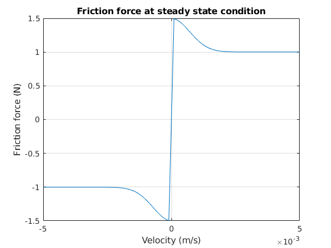
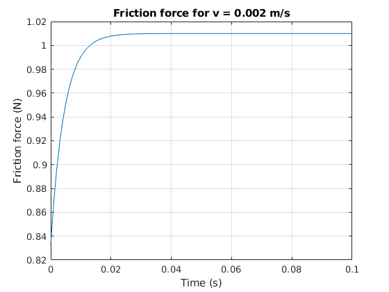
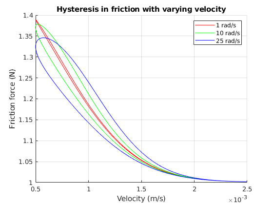
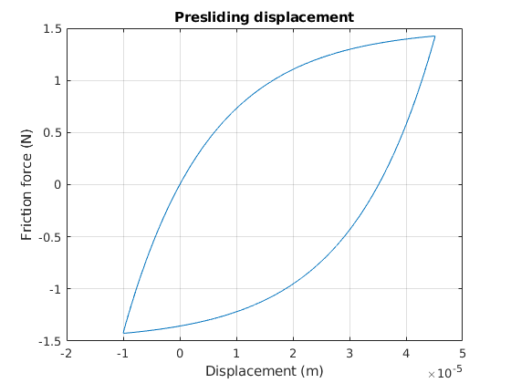
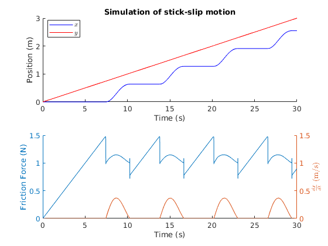
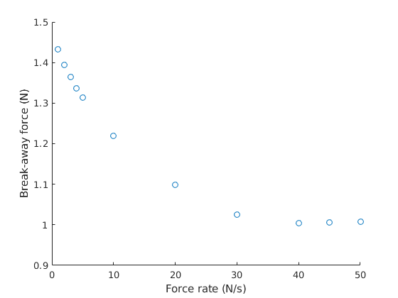
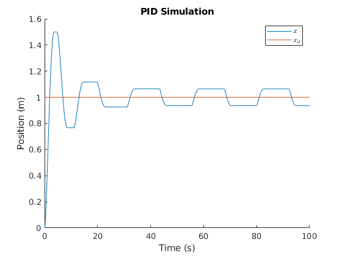
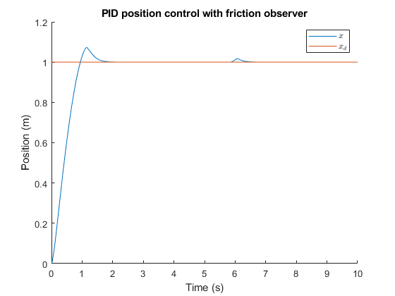
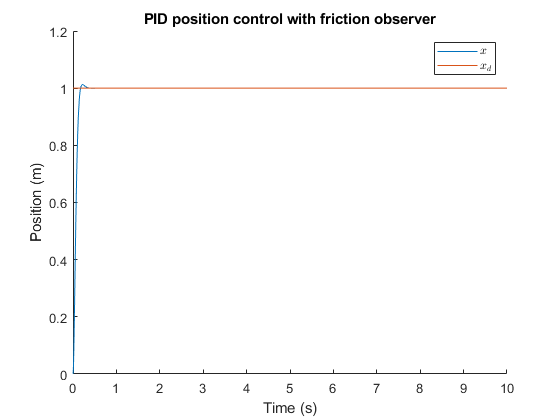

This is a *full reconstruction* of the paper: **A new model for control systems with friction** by Canudas de Wit et al. The paper was published in 1995 (IEEE Transactions on Automatic Control). It can be found in the following link: https://ieeexplore.ieee.org/document/376053  

In this repository, there are 3 main m-files:

2. demo2.m

Here, we use the built-in MATLAB solver: ode23s. This solver is designed for a stiff system. In order to use MATLAB built-in solver, the problem must be first formalized. Plese see the PDF file [here](./problem_formalization.pdf).

3. demo3.m

This is an additional simulation to demonstrate the friction observer. This is not shown in the paper. Basically, this is the numerical simulation of section V.B, for position control with a unit-step input.

4. demo4.m 

This shows optimally tuned PI and velocity gain without the friction observer. The performance is superior to the friction observer with poorly tuned PI and velocity gains.

-------------------------------

Not shown in the paper. Run demo2.

-------------------------------

Not shown in the paper. Run demo2.

-------------------------------

Fig. 3 of the paper. Run demo2.

-------------------------------

Fig. 2 of the paper. Run demo2.

-------------------------------

Fig. 6 of the paper. Run demo2.

-------------------------------

Fig. 4 of the paper. Run demo2.

-------------------------------

Fig. 8 of the paper. Run demo2.

-------------------------------

Not shown in the paper. Run demo3.

-------------------------------

Note that if the PI and velocity gains are optimally tuned, then the performance is better than the friction observer. Rise time is smaller and overshoot is smaller. This model is generally easier to tune. Run demo4.

